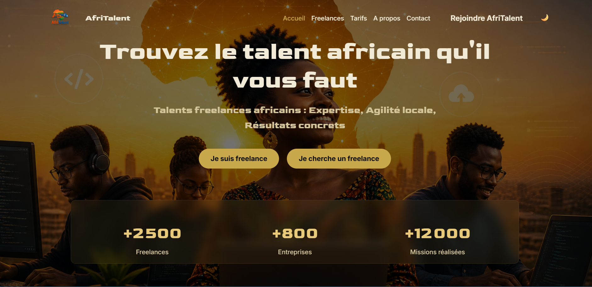
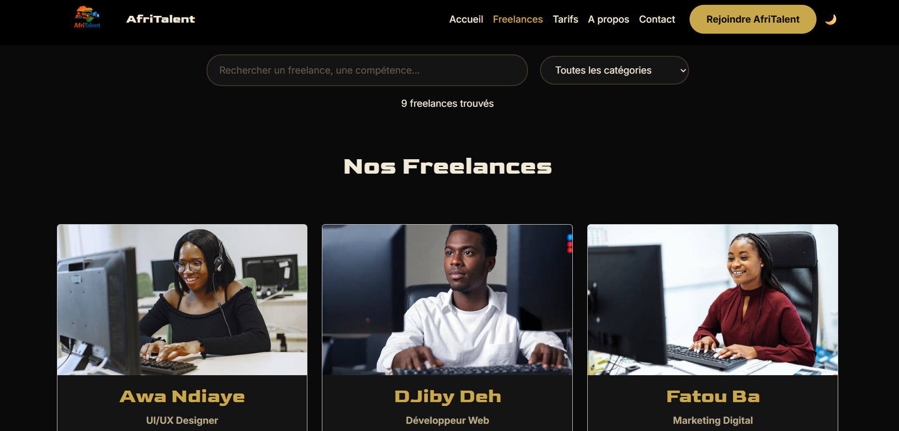

# AfriTalent 
Projet fil rouge — Plateforme de mise en relation entre freelances africains et 
clients. 
Auteur : Mouhamed Diom
Promotion : L1 IAGE — ISI 


# AfriTalent 🌍

> Plateforme de mise en relation entre freelances africains et entreprises — Projet S2 2026

---

## 📋 Description

**AfriTalent** est une plateforme web fictive dédiée à la mise en relation de freelances africains avec des entreprises à la recherche de compétences tech, créatives et digitales. Ce projet a été réalisé dans le cadre du semestre 2 et vise à démontrer la maîtrise des technologies front-end modernes : HTML5, CSS3, Bootstrap 5 et JavaScript vanilla.

---

## 🚀 En ligne

🔗 [Voir le site sur GitHub Pages](https://mouhameddiom11-ux.github.io/DIOM-MOUHAMED-AFRITALENT/)

---

## 🗂️ Structure du projet

```
NOM-Prenom-AfriTalent/
├── index.html              # Page d'accueil
├── freelances.html         # Catalogue des freelances
├── tarifs.html             # Plans et tarification
├── about.html              # À propos
├── contact.html            # Formulaire de contact
├── css/
│   └── style.css           # Feuille de style principale
├── js/
│   └── main.js             # Scripts JavaScript vanilla
├── images/
│   └── ...                 # Logo, avatars, illustrations
├── docs/
│   └── NOM_Prenom_Presentation.pptx
├── README.md
└── .gitignore
```

---

## 📄 Pages

| Page | Fichier | Description |
|------|---------|-------------|
| Accueil | `index.html` | Hero, comment ça marche, catégories, témoignages, CTA |
| Freelances | `freelances.html` | Catalogue filtrable de 9 profils fictifs |
| Tarifs | `tarifs.html` | 3 plans tarifaires + FAQ en accordion |
| À propos | `about.html` | Histoire, équipe, valeurs, chiffres clés |
| Contact | `contact.html` | Formulaire validé, carte Google Maps |

---

## ✨ Fonctionnalités

- 🌙 **Dark Mode / Light Mode** — toggle persisté via `localStorage`
- 🔢 **Compteurs animés** — déclenchés au scroll avec `IntersectionObserver`
- 🔍 **Filtrage dynamique** — filtrage des freelances par catégorie sans rechargement
- ✅ **Validation de formulaire** — retour visuel (bordures, messages d'erreur, succès)
- 📌 **Navbar dynamique** — changement de style au défilement (effet shrink)
- ⬆️ **Bouton « Retour en haut »** — apparaît au scroll, smooth scroll
- 🎞️ **Animations au scroll** — sections en fade-in via `IntersectionObserver`

---

## 🛠️ Technologies utilisées

| Technologie | Usage |
|-------------|-------|
| HTML5 sémantique | Structure des pages (`<header>`, `<nav>`, `<main>`, `<section>`, `<footer>`) |
| CSS3 | Flexbox, Grid, Bento Grid, animations, variables CSS, responsive design |
| Bootstrap 5 (CDN) | Navbar, grille, cards, carousel, accordion, modal |
| Bootstrap Icons | Icônes dans tout le site |
| Google Fonts | Polices pour titres et corps de texte |
| JavaScript vanilla | DOM, événements, validation, dark mode, compteurs, filtres |
| Git & GitHub Pages | Versioning et déploiement |

---

## 🎨 Design

- **Palette** : 5 couleurs principales définies via variables CSS (`:root`)
- **Typographie** : 2 polices Google Fonts (titres + corps)
- **Responsive** : mobile (375px), tablette (768px), desktop (1200px+)
- **Accessibilité** : attributs `alt` sur toutes les images, contrastes suffisants, navigation clavier

---
## Aperçu





 

 

 

## ⚙️ Installation locale

git 

# Ouvrir dans le navigateur
cd NOM-Prenom-AfriTalent
open index.html


## 📦 Déploiement GitHub Pages

1. Pousser le projet sur un dépôt GitHub public
2. Aller dans **Settings → Pages**
3. Source : `Deploy from a branch` → branche `main` → dossier `/ (root)`
4. Le site sera accessible à https://mouhameddiom11-ux.github.io/DIOM-MOUHAMED-AFRITALENT/

---

## 📁 Ressources externes

- [Bootstrap 5](https://getbootstrap.com/)
- [Bootstrap Icons](https://icons.getbootstrap.com/)
- [Google Fonts](https://fonts.google.com/)
- Images : [Unsplash](https://unsplash.com/) / [UI Avatars](https://ui-avatars.com/)

---


*© 2026 AfriTalent — Projet pédagogique*
